<div align="center">

# 🚀 Enterprise CI/CD Platform

### A Production-Grade, Fully Local CI/CD, Monitoring & Logging Ecosystem

*Automated Testing • Containerized Deployment • Real-Time Observability — No Cloud Required*

[](https://www.python.org/)
[](https://flask.palletsprojects.com/)
[](https://www.docker.com/)
[](https://docs.docker.com/compose/)
[](https://www.jenkins.io/)
[](https://prometheus.io/)
[](https://grafana.com/)
[](https://grafana.com/oss/loki/)
[](https://github.com/Sahilll777)
[](LICENSE)

[](#)
[](#)
[](#)
[](#)
[](#)

<br/>

**[Overview](#-overview)** •
**[Architecture](#-system-architecture)** •
**[Pipeline](#-cicd-pipeline-stages)** •
**[Monitoring](#-monitoring--observability)** •
**[Installation](#-installation-guide)** •
**[Screenshots](#-screenshots)** •
**[API](#-api-documentation)** •
**[Roadmap](#-future-improvements--roadmap)**

</div>

<br/>

---

## 📖 Overview

**Enterprise CI/CD Platform** is a fully self-hosted, production-style DevOps ecosystem built entirely on local infrastructure — **no AWS, Azure, or GCP required**. It replicates the automation pipeline of a real enterprise engineering team: every `git push` triggers an automated Jenkins pipeline that checks out code, provisions an isolated Python environment, installs dependencies, validates configuration, runs the full unit test suite, generates a coverage report, builds a Docker image, deploys the stack via Docker Compose, and verifies application health — all before metrics and logs start flowing into Prometheus, Grafana, and Loki.

> **💡 Why this project exists**
> Most portfolio projects stop at "the app runs." This project demonstrates the *entire* software delivery lifecycle — build, test, package, deploy, observe — the way a real platform engineering team would implement it, using free and open-source tooling that runs entirely on a developer's machine.

### ✨ Highlights

| Capability | Description |
|---|---|
| 🔁 **Fully Automated Pipeline** | Every commit triggers checkout → test → build → deploy → verify, with zero manual steps |
| 🐳 **Multi-Container Architecture** | Flask, MySQL, Redis, Nginx, Prometheus, Grafana, Loki, and Promtail orchestrated via Docker Compose |
| 📊 **Real-Time Observability** | Prometheus scrapes application metrics; Grafana visualizes them in live dashboards |
| 📜 **Centralized Logging** | Promtail ships container logs to Loki, queryable through Grafana Explore |
| ✅ **Quality Gates** | Automated Pytest suite and coverage reporting run on every build |
| 🏥 **Self-Verifying Deployments** | Post-deploy health checks confirm the application is live before the pipeline succeeds |
| 🖥️ **100% Local** | No cloud account, no billing, no external dependency — runs entirely on your machine |

<br/>

---

## 🧰 Tech Stack

<div align="center">

| Layer | Technology |
|:---|:---|
| **Backend** | Python 3.12, Flask |
| **Database** | MySQL |
| **Cache** | Redis |
| **Reverse Proxy** | Nginx |
| **CI/CD** | Jenkins |
| **Containers** | Docker, Docker Compose |
| **Testing** | Pytest, Coverage.py |
| **Monitoring** | Prometheus |
| **Visualization** | Grafana |
| **Logging** | Loki, Promtail |
| **Version Control** | Git, GitHub |
| **Automation** | GitHub Webhooks |

</div>

<br/>

---

## 🌟 Project Features

<table>
<tr><td>

- ✔ Automated Jenkins Pipeline
- ✔ GitHub Webhook Integration
- ✔ Automatic Source Code Checkout
- ✔ Python Virtual Environment Creation
- ✔ Dependency Installation
- ✔ Environment Validation
- ✔ Flask Application Validation
- ✔ Automated Unit Testing

</td><td>

- ✔ Coverage Report Generation
- ✔ Docker Image Build
- ✔ Docker Compose Deployment
- ✔ Health Check Verification
- ✔ Prometheus Metrics Collection
- ✔ Grafana Dashboards
- ✔ Loki Centralized Logging
- ✔ Promtail Log Collection

</td></tr>
</table>

<br/>

---

## 🏗 System Architecture

The platform connects source control, CI/CD automation, containerized runtime, and observability into a single closed loop.

<div align="center">
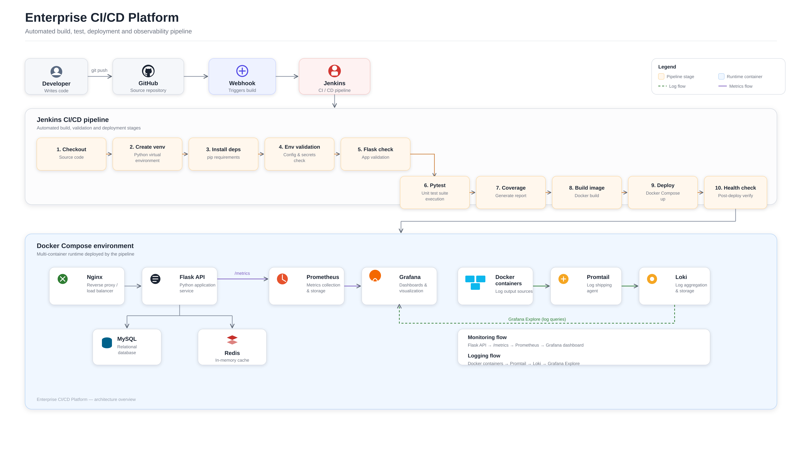

*Figure 1 — High-level system architecture: source control, pipeline automation, container runtime, and observability stack*
</div>

### Architecture Flow

```
Developer
   │  git push
   ▼
GitHub Repository
   │  webhook event
   ▼
GitHub Webhook
   │  triggers build
   ▼
Jenkins Pipeline
   │  test → build
   ▼
Docker Build
   │  image ready
   ▼
Docker Compose
   │  orchestrates services
   ▼
Flask Application
   │  exposes /metrics
   ▼
Prometheus  ──────▶  Grafana  ◀──────  Loki
```

### Interaction Breakdown

| Step | Component | Interaction |
|---|---|---|
| 1 | **Developer** | Writes code locally and pushes commits to the `main` branch |
| 2 | **GitHub** | Stores the canonical source of truth for the repository |
| 3 | **GitHub Webhook** | Fires an HTTP POST to Jenkins the instant a push is detected |
| 4 | **Jenkins** | Executes the full pipeline: checkout, environment setup, tests, build |
| 5 | **Docker Build** | Packages the Flask application and its dependencies into an image |
| 6 | **Docker Compose** | Brings up Flask, MySQL, Redis, Nginx, Prometheus, Grafana, Loki, and Promtail as a coordinated stack |
| 7 | **Flask** | Serves application traffic and exposes a `/metrics` endpoint |
| 8 | **Prometheus** | Continuously scrapes `/metrics` and stores time-series data |
| 9 | **Grafana** | Queries Prometheus for dashboards and Loki for log exploration |
| 10 | **Loki** | Aggregates logs shipped by Promtail from all running containers |

<br/>

---

## 🔄 CI/CD Pipeline Stages

<div align="center">
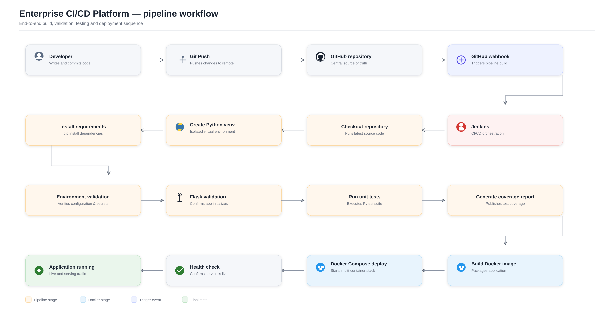

*Figure 2 — End-to-end Jenkins pipeline workflow*
</div>

### Mermaid — CI/CD Workflow

```mermaid
flowchart LR
    A[Developer] -->|git push| B[GitHub Repository]
    B -->|webhook| C[Jenkins Triggered]
    C --> D[Checkout Source]
    D --> E[Repository Info]
    E --> F[Python Info]
    F --> G[Create Virtual Env]
    G --> H[Install Dependencies]
    H --> I[Environment Validation]
    I --> J[Flask Validation]
    J --> K[Run Unit Tests]
    K --> L[Generate Coverage]
    L --> M[Docker Build]
    M --> N[Docker Compose Deploy]
    N --> O[Health Check]
    O --> P{Healthy?}
    P -->|Yes| Q[✅ Pipeline Success]
    P -->|No| R[❌ Pipeline Failed]

    style Q fill:#2E7D32,color:#fff
    style R fill:#C0392B,color:#fff
    style C fill:#D24939,color:#fff
```

Below is a detailed breakdown of **every stage** in the Jenkinsfile, including purpose, representative commands, expected output, and why it matters.

<details>
<summary><strong>1️⃣ Checkout</strong></summary>

<br/>

**Purpose:** Pulls the latest commit from the GitHub repository into the Jenkins workspace.

**Commands executed:**
```bash
git clone https://github.com/Sahilll777/enterprise-cicd-platform.git
git checkout main
```

**Expected output:**
```
Cloning into 'enterprise-cicd-platform'...
Checking out files: 100% done
Already on 'main'
```

**Why it matters:** Guarantees the pipeline always builds and tests the exact code that was just pushed, eliminating "it works on my machine" drift.

</details>

<details>
<summary><strong>2️⃣ Repository Information</strong></summary>

<br/>

**Purpose:** Logs commit metadata (author, hash, branch, message) for build traceability.

**Commands executed:**
```bash
git log -1 --pretty=format:"%H %an %s"
git branch --show-current
```

**Expected output:**
```
Commit: 7f3a9c1  Author: Sahil Bhosale  Message: Add health check endpoint
Branch: main
```

**Why it matters:** Every build artifact can be traced back to a specific commit — critical for audits and rollback decisions.

</details>

<details>
<summary><strong>3️⃣ Python Information</strong></summary>

<br/>

**Purpose:** Confirms the correct Python runtime is available on the Jenkins agent before proceeding.

**Commands executed:**
```bash
python3 --version
pip3 --version
```

**Expected output:**
```
Python 3.12.1
pip 24.0
```

**Why it matters:** Prevents subtle failures caused by an unexpected interpreter version on the build agent.

</details>

<details>
<summary><strong>4️⃣ Create Virtual Environment</strong></summary>

<br/>

**Purpose:** Provisions an isolated Python environment so dependencies never leak into the system interpreter.

**Commands executed:**
```bash
python3 -m venv venv
source venv/bin/activate
```

**Expected output:**
```
Virtual environment created at ./venv
```

**Why it matters:** Ensures reproducible, conflict-free builds regardless of what else is installed on the agent.

</details>

<details>
<summary><strong>5️⃣ Install Dependencies</strong></summary>

<br/>

**Purpose:** Installs all Python packages required by the Flask application and test suite.

**Commands executed:**
```bash
pip install --upgrade pip
pip install -r requirements.txt
```

**Expected output:**
```
Successfully installed Flask-3.0.0 pytest-8.0.0 coverage-7.4.0 ...
```

**Why it matters:** Guarantees every build uses the exact dependency versions pinned in `requirements.txt`.

</details>

<details>
<summary><strong>6️⃣ Environment Validation</strong></summary>

<br/>

**Purpose:** Verifies required environment variables, config files, and secrets are present before runtime.

**Commands executed:**
```bash
python scripts/validate_env.py
```

**Expected output:**
```
[OK] DATABASE_URL is set
[OK] REDIS_HOST is set
[OK] All required environment variables validated
```

**Why it matters:** Fails fast on misconfiguration instead of surfacing cryptic errors after deployment.

</details>

<details>
<summary><strong>7️⃣ Flask Validation</strong></summary>

<br/>

**Purpose:** Confirms the Flask application factory initializes correctly and routes are registered.

**Commands executed:**
```bash
python -c "from app import create_app; create_app()"
```

**Expected output:**
```
Flask app created successfully. Routes registered: 12
```

**Why it matters:** Catches import errors, misconfigured blueprints, or broken app factories before they reach testing.

</details>

<details>
<summary><strong>8️⃣ Run Unit Tests</strong></summary>

<br/>

**Purpose:** Executes the full automated test suite against the application.

**Commands executed:**
```bash
pytest tests/ -v --tb=short
```

**Expected output:**
```
tests/test_health.py::test_health_endpoint PASSED
tests/test_api.py::test_create_resource PASSED
========== 42 passed in 3.87s ==========
```

**Why it matters:** Acts as the primary quality gate — a failing test blocks the pipeline before a broken build reaches Docker.

</details>

<details>
<summary><strong>9️⃣ Generate Coverage Report</strong></summary>

<br/>

**Purpose:** Measures how much of the codebase is exercised by tests and publishes a report.

**Commands executed:**
```bash
coverage run -m pytest
coverage report -m
coverage html
```

**Expected output:**
```
Name                 Stmts   Miss  Cover
----------------------------------------
app/routes.py           58      4    93%
app/models.py            34      2    94%
----------------------------------------
TOTAL                   210     17    92%
```

**Why it matters:** Provides an objective quality signal and highlights untested code paths.

</details>

<details>
<summary><strong>🔟 Docker Build</strong></summary>

<br/>

**Purpose:** Packages the application, its dependencies, and runtime into a portable Docker image.

**Commands executed:**
```bash
docker build -t enterprise-cicd-platform:latest .
```

**Expected output:**
```
Successfully built 4f8a2e91c3d2
Successfully tagged enterprise-cicd-platform:latest
```

**Why it matters:** Produces a single immutable artifact that behaves identically across every environment.

</details>

<details>
<summary><strong>1️⃣1️⃣ Deploy (Docker Compose)</strong></summary>

<br/>

**Purpose:** Brings up the full multi-container stack — Flask, MySQL, Redis, Nginx, Prometheus, Grafana, Loki, Promtail.

**Commands executed:**
```bash
docker compose down
docker compose up -d --build
```

**Expected output:**
```
✔ Container flask-api        Started
✔ Container mysql-db         Started
✔ Container redis-cache      Started
✔ Container nginx-proxy      Started
✔ Container prometheus       Started
✔ Container grafana          Started
✔ Container loki             Started
✔ Container promtail         Started
```

**Why it matters:** Replaces manual deployment with a single deterministic command, matching how real teams ship containerized services.

</details>

<details>
<summary><strong>1️⃣2️⃣ Health Check</strong></summary>

<br/>

**Purpose:** Confirms the deployed application is actually responding before marking the pipeline successful.

**Commands executed:**
```bash
curl -f http://localhost:5000/health || exit 1
```

**Expected output:**
```json
{"status": "healthy", "uptime": "12s", "version": "1.4.0"}
```

**Why it matters:** Prevents Jenkins from reporting a "successful" deployment when the application actually failed to start.

</details>

<br/>

> **📌 Note**
> All stages run sequentially and the pipeline halts immediately on the first failure, ensuring broken builds never reach production containers.

<br/>

---

## 📊 Monitoring & Observability

<div align="center">
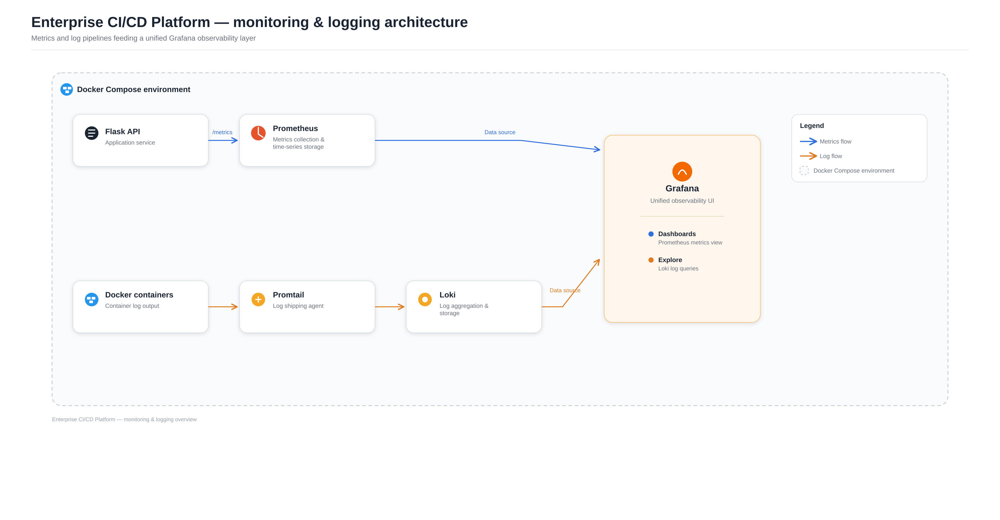

*Figure 3 — Metrics and logging pipelines feeding a unified Grafana layer*
</div>

The platform ships with a complete observability stack so you can watch the application's health, performance, and logs in real time — no external SaaS required.

### Component Overview

| Component | Role |
|---|---|
| **Prometheus** | Pulls metrics from the Flask `/metrics` endpoint on a fixed scrape interval and stores them as time-series data |
| **Grafana** | Queries Prometheus for dashboards and Loki for log exploration, unifying both into one UI |
| **Loki** | Aggregates and indexes logs shipped from every running container |
| **Promtail** | Runs as a lightweight agent that tails container logs and forwards them to Loki |

### How Metrics Are Collected

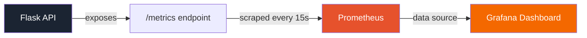

### How Logs Are Collected

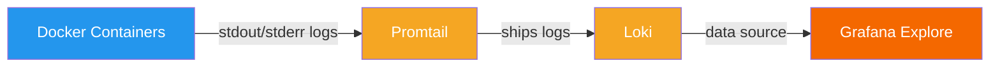

### Unified Observability

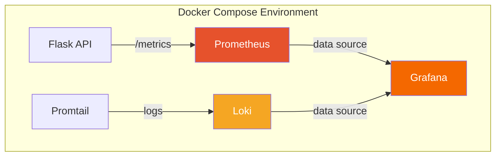

**Grafana connects to both Prometheus and Loki as independent data sources** — Prometheus powers the metrics dashboards, while Loki powers the Explore view for log queries, giving you a single pane of glass for both performance and troubleshooting.

<br/>

> **💡 Tip**
> Use Grafana's **Explore** tab with a LogQL query like `{container="flask-api"}` to stream live application logs without touching the terminal.

<br/>

---

## 📸 Screenshots

<details>
<summary><strong>🏠 01 — Application Home</strong></summary>
<br/>
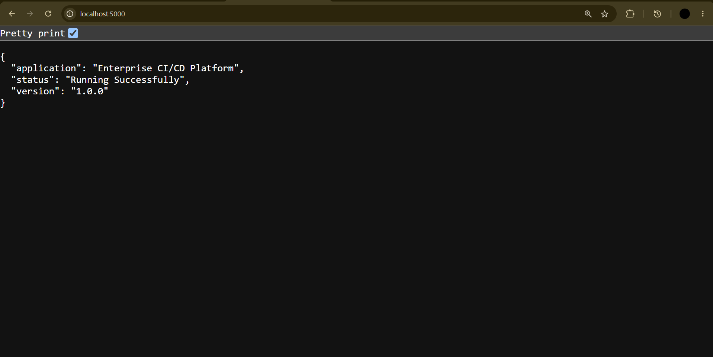

The Flask application landing page, confirming the service is deployed and reachable.
</details>

<details>
<summary><strong>🧩 02 — Jenkins Dashboard</strong></summary>
<br/>
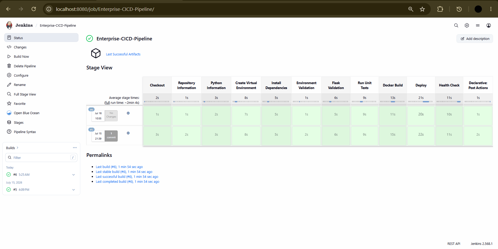

The Jenkins dashboard showing job history and pipeline status at a glance.
</details>

<details>
<summary><strong>✅ 03 — Pipeline Success</strong></summary>
<br/>
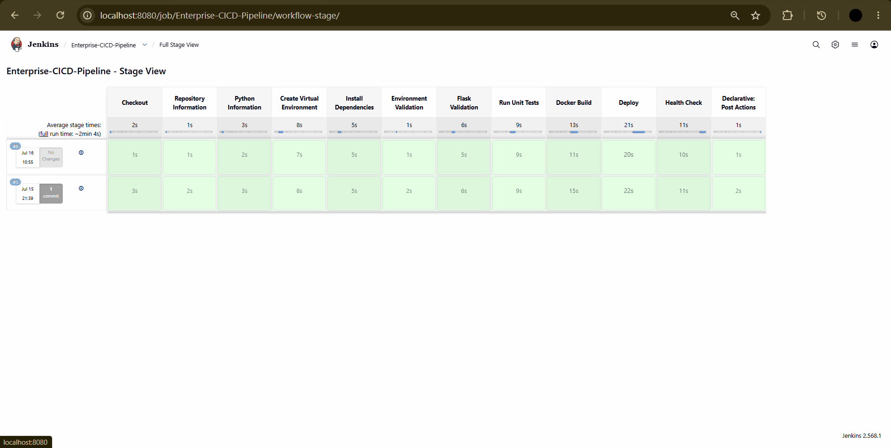

A completed pipeline run with every stage — checkout through health check — passing green.
</details>

<details>
<summary><strong>🏗 04 — Build Success</strong></summary>
<br/>
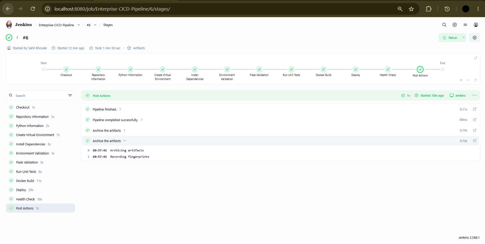

Console output confirming a successful Docker image build.
</details>

<details>
<summary><strong>🎯 05 — Prometheus Targets</strong></summary>
<br/>
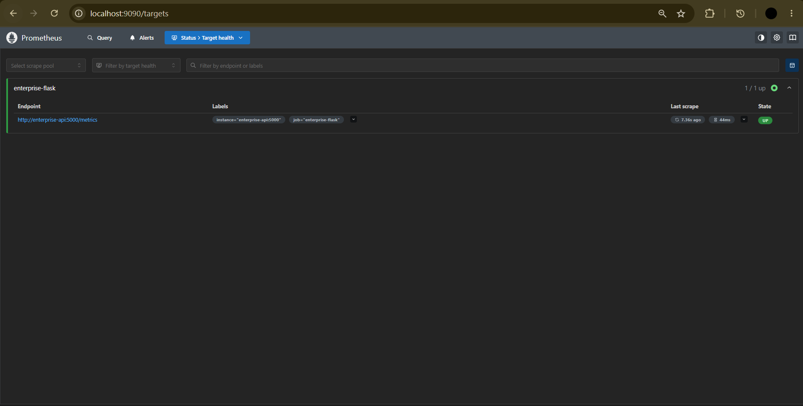

The Prometheus targets page showing the Flask `/metrics` endpoint as healthy (`UP`).
</details>

<details>
<summary><strong>📈 06 — Grafana Dashboard</strong></summary>
<br/>
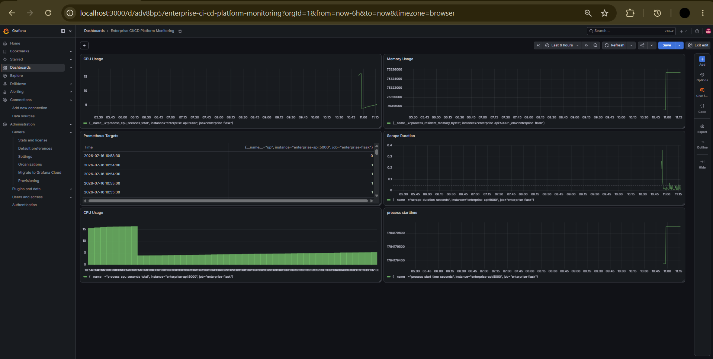

A live Grafana dashboard visualizing request rate, latency, and error metrics.
</details>

<details>
<summary><strong>📜 07 — Loki Logs</strong></summary>
<br/>
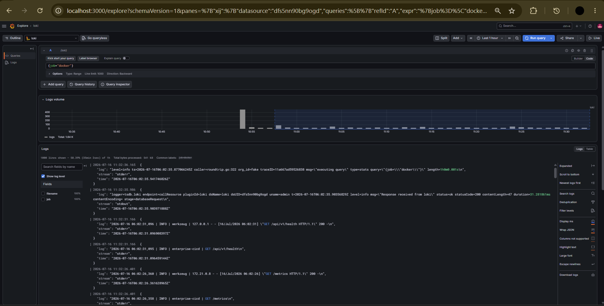

Grafana Explore streaming centralized logs aggregated by Loki.
</details>

<details>
<summary><strong>🔗 08 — GitHub Webhook</strong></summary>
<br/>
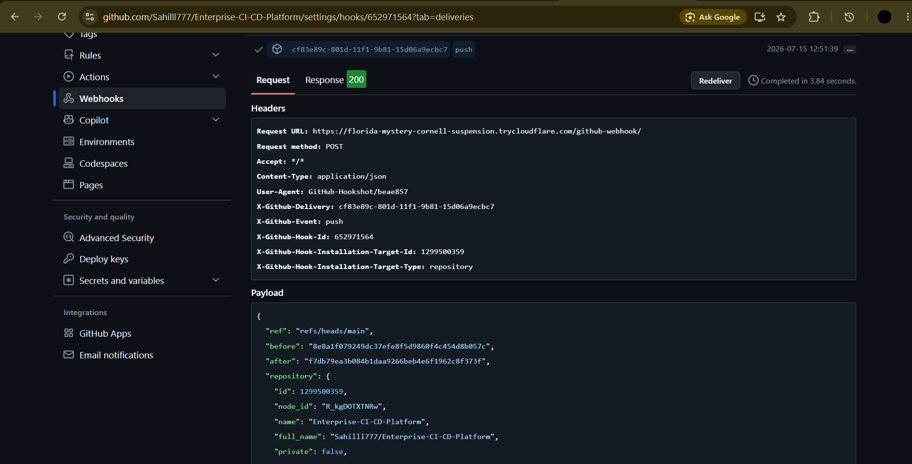

The configured GitHub webhook that triggers Jenkins on every push.
</details>

<details>
<summary><strong>🐳 09 — Running Containers</strong></summary>
<br/>
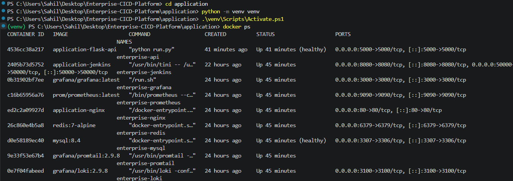

`docker ps` output showing the full multi-container stack running healthily.
</details>

<details>
<summary><strong>🏥 10 — Health API</strong></summary>
<br/>
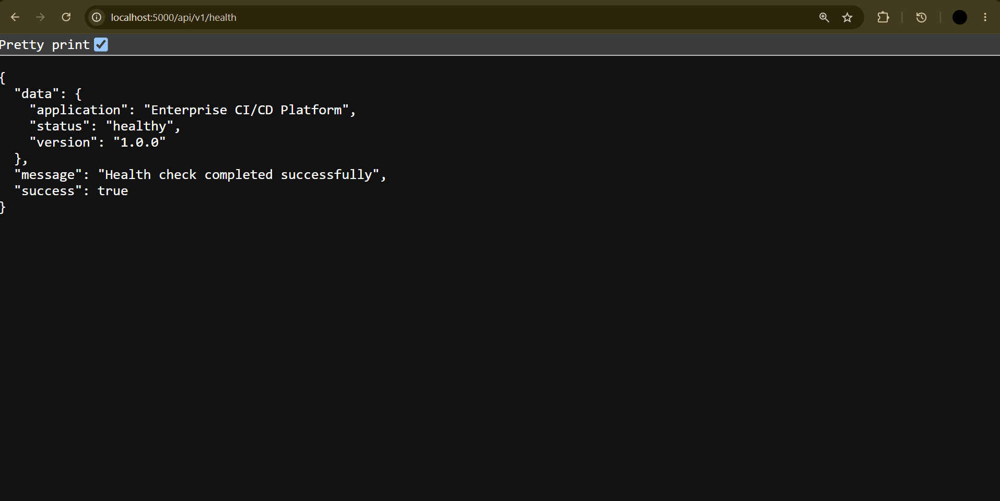

The `/health` endpoint returning a healthy JSON status response.
</details>

<br/>

---

## ⚙️ Installation Guide

> **⚠️ Warning**
> This guide assumes a local development machine running macOS, Linux, or Windows with WSL2. Ensure at least 8GB of RAM is available for the full container stack.

### 1. Prerequisites

| Tool | Minimum Version | Download |
|---|---|---|
| Git | 2.30+ | [git-scm.com](https://git-scm.com/) |
| Docker Desktop | 24.0+ | [docker.com](https://www.docker.com/products/docker-desktop/) |
| Python | 3.12+ | [python.org](https://www.python.org/) |
| Jenkins | 2.440+ (or via container) | [jenkins.io](https://www.jenkins.io/) |

### 2. Clone the Repository

```bash
git clone https://github.com/Sahilll777/enterprise-cicd-platform.git
cd enterprise-cicd-platform
```

### 3. Create a Python Virtual Environment

```bash
python3 -m venv venv

# macOS / Linux
source venv/bin/activate

# Windows
venv\Scripts\activate
```

### 4. Install Dependencies

```bash
pip install --upgrade pip
pip install -r requirements.txt
```

### 5. Start the Docker Compose Stack

```bash
docker compose up -d --build
```

This provisions **Flask, MySQL, Redis, Nginx, Prometheus, Grafana, Loki, and Promtail** as a coordinated multi-container environment.

### 6. Run Flask Locally (optional, outside Docker)

```bash
export FLASK_APP=app
export FLASK_ENV=development
flask run
```

### 7. Configure Jenkins

```bash
docker run -d -p 8080:8080 -p 50000:50000 \
  -v jenkins_home:/var/jenkins_home \
  jenkins/jenkins:lts
```

Then install the **Git**, **Pipeline**, and **Docker Pipeline** plugins, and point a new Pipeline job at this repository's `Jenkinsfile`.

### 8. Configure the GitHub Webhook

In your repository settings, add a webhook pointing to:

```
http://<your-jenkins-host>:8080/github-webhook/
```

Content type: `application/json` · Event: **Just the push event**

### 9. Access URLs

| Service | URL | Default Credentials |
|---|---|---|
| Flask Application | `http://localhost:5000` | — |
| Jenkins | `http://localhost:8080` | Set on first login |
| Prometheus | `http://localhost:9090` | — |
| Grafana | `http://localhost:3000` | `admin` / `admin` |
| Loki | `http://localhost:3100` | — (queried via Grafana) |

<br/>

> **✅ Tip**
> Run `docker compose ps` at any time to confirm every service is `Up` and `healthy`.

<br/>

---

## 📁 Project Structure

```
enterprise-cicd-platform/
├── app/
│   ├── __init__.py
│   ├── routes.py
│   ├── models.py
│   └── metrics.py
├── tests/
│   ├── test_health.py
│   └── test_api.py
├── docker/
│   ├── Dockerfile
│   ├── nginx/
│   │   └── nginx.conf
│   ├── prometheus/
│   │   └── prometheus.yml
│   ├── grafana/
│   │   └── provisioning/
│   ├── loki/
│   │   └── loki-config.yml
│   └── promtail/
│       └── promtail-config.yml
├── scripts/
│   └── validate_env.py
├── docs/
│   ├── diagrams/
│   │   ├── architecture.png
│   │   ├── ci-cd-flow.png
│   │   └── monitoring.png
│   └── screenshots/
│       ├── 01-home.png
│       ├── 02-jenkins-dashboard.png
│       ├── 03-pipeline-success.png
│       ├── 04-build-success.png
│       ├── 05-prometheus-targets.png
│       ├── 06-grafana-dashboard.png
│       ├── 07-loki-logs.png
│       ├── 08-github-webhook.png
│       ├── 09-running-containers.png
│       └── 10-health-api.png
├── docker-compose.yml
├── Jenkinsfile
├── requirements.txt
├── .env.example
├── LICENSE
└── README.md
```

<br/>

---

## 🔌 API Documentation

### Health Check Endpoint

```
GET /health
```

**Description:** Returns the current health status of the application, used by the Jenkins pipeline's post-deploy verification stage and by Docker Compose health checks.

**Example Request**

```bash
curl -X GET http://localhost:5000/health
```

**Example Response**

```json
{
  "status": "healthy",
  "uptime": "3h 12m",
  "version": "1.4.0",
  "database": "connected",
  "cache": "connected"
}
```

| Field | Type | Description |
|---|---|---|
| `status` | string | `healthy` or `unhealthy` |
| `uptime` | string | Time since the process started |
| `version` | string | Deployed application version |
| `database` | string | MySQL connection status |
| `cache` | string | Redis connection status |

<br/>

---

## 🗺 Future Improvements & Roadmap

- [ ] Kubernetes migration for container orchestration
- [ ] Helm charts for templated deployments
- [ ] SonarQube integration for static code analysis
- [ ] Trivy for container image vulnerability scanning
- [ ] ArgoCD for GitOps-based continuous delivery
- [ ] Terraform for infrastructure as code
- [ ] GitHub Actions as an alternative CI runner
- [ ] Azure DevOps pipeline support
- [ ] AWS deployment target (ECS/EKS)
- [ ] Azure deployment target (AKS)
- [ ] Multi-node Jenkins agent cluster
- [ ] Blue-green deployment strategy
- [ ] Canary deployment strategy
- [ ] Horizontal scaling with a container orchestrator

<br/>

---

## 📄 License

This project is licensed under the **MIT License** — see the [LICENSE](LICENSE) file for details.

<br/>

---

## 👤 Author

<div align="center">

**Sahil Bhosale**

[](https://github.com/Sahilll777)

</div>

<br/>

---

<div align="center">

**⭐ If this project helped you understand enterprise CI/CD practices, consider giving it a star!**

</div>
